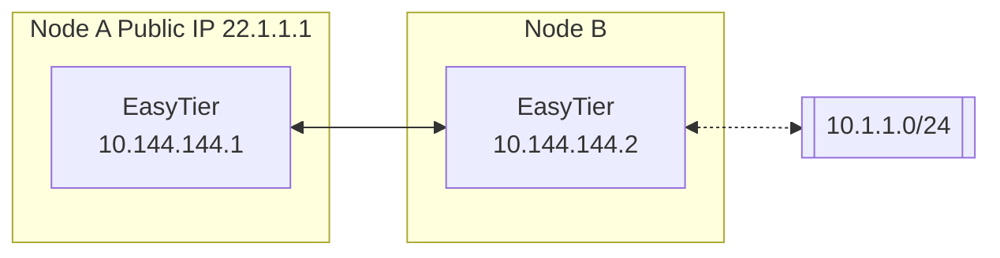
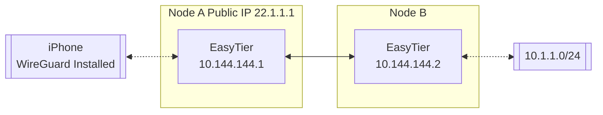

# EasyTier

[](https://github.com/EasyTier/EasyTier/releases)
[](https://github.com/EasyTier/EasyTier/blob/main/LICENSE)
[](https://github.com/EasyTier/EasyTier/commits/main)
[](https://github.com/EasyTier/EasyTier/issues)
[](https://github.com/EasyTier/EasyTier/actions/workflows/core.yml)
[](https://github.com/EasyTier/EasyTier/actions/workflows/gui.yml)
[](https://github.com/EasyTier/EasyTier/actions/workflows/test.yml)
[](https://deepwiki.com/EasyTier/EasyTier)

[简体中文](/README_CN.md) | [English](/README.md)

> ✨ A simple, secure, decentralized virtual private network solution powered by Rust and Tokio

<p align="center">


</p>

📚 **[Full Documentation](https://easytier.cn/en/)** | 🖥️ **[Web Console](https://easytier.cn/web)** | 📝 **[Download Releases](https://github.com/EasyTier/EasyTier/releases)** | 🧩 **[Third Party Tools](https://easytier.cn/en/guide/installation_gui.html#third-party-graphical-interfaces)** | ❤️ **[Sponsor](#sponsor)**

## Features

### Core Features

- 🔒 **Decentralized**: Nodes are equal and independent, no centralized services required  
- 🚀 **Easy to Use**: Multiple operation methods via web, client, and command line  
- 🌍 **Cross-Platform**: Supports Win/MacOS/Linux/FreeBSD/Android and X86/ARM/MIPS architectures  
- 🔐 **Secure**: AES-GCM or WireGuard encryption, prevents man-in-the-middle attacks  

### Advanced Capabilities

- 🔌 **Efficient NAT Traversal**: Supports UDP and IPv6 traversal, works with NAT4-NAT4 networks  
- 🌐 **Subnet Proxy**: Nodes can share subnets for other nodes to access  
- 🔄 **Intelligent Routing**: Latency priority and automatic route selection for best network experience  
- ⚡ **High Performance**: Zero-copy throughout the entire link, supports TCP/UDP/WSS/WG protocols  

### Network Optimization

- 📊 **UDP Loss Resistance**: KCP/QUIC proxy optimizes latency and bandwidth in high packet loss environments  
- 🔧 **Web Management**: Easy configuration and monitoring through web interface  
- 🛠️ **Zero Config**: Simple deployment with statically linked executables  

## Quick Start

### 📥 Installation

Choose the installation method that best suits your needs:

Linux (Recommended):
```bash
curl -fsSL "https://github.com/EasyTier/EasyTier/blob/main/script/install.sh?raw=true" | sudo bash -s install
```

Homebrew (MacOS/Linux):
```bash
brew tap brewforge/chinese
brew install --cask easytier-gui
```

Windows (Recommended, run with administrator privileges):
```powershell
irm "https://github.com/EasyTier/EasyTier/blob/main/script/install.ps1?raw=true" | iex
```

Install via cargo (Latest development version): 
```bash
cargo install --git https://github.com/EasyTier/EasyTier.git easytier
```

[Install pre-built binary](https://github.com/EasyTier/EasyTier/releases) (Recommended, All platforms supported)

[Install via Docker](https://easytier.cn/en/guide/installation.html#installation-methods)

[Install OpenWrt ipk package](https://github.com/EasyTier/luci-app-easytier)

Additional steps:

[One-Click Register Service](https://easytier.cn/en/guide/network/oneclick-install-as-service.html) (Automatically start when the system boots and run in the background)

### GitHub Actions Build Order

If you use a public fork for builds and releases, the current GitHub Actions flow has an explicit order dependency:

1. Push the target commit to `develop`, `main`, or `releases/**` in your fork.
2. Wait for `EasyTier Core`, `EasyTier GUI`, `EasyTier Mobile`, `EasyTier Test`, and `EasyTier OHOS` to finish successfully for the same commit.
3. Run `EasyTier Release` manually on the same ref and fill in the release version.

Notes:

- `EasyTier Release` resolves the required workflow run IDs automatically from the selected ref's commit SHA, validates the requested version against Cargo metadata, and refuses to overwrite an existing tag.
- If `EasyTier Release` reports that a successful workflow run is missing, the selected ref does not yet have all required builds and tests for that commit. Re-run those workflows first, then trigger release again.
- OHOS artifacts are included in the GitHub Release. The release is published only after all required workflows succeed.
- The Docker workflow has been removed from this fork-specific flow.

## Fork-Specific Changes

This repository is no longer a drop-in mirror of upstream EasyTier. The summary
below reflects the fork-only delta over upstream. If you are comparing behavior
with upstream, upgrading an existing deployment, or deciding which parameters
to enable, read this first:

- Fixes and hardening in this fork: multi-transport stealth rollout and
  compatibility; target-scoped self-loop backoff for direct / hole-punch paths
  instead of broad scheme suppression; QUIC/KCP proxy readiness ACK and
  classified failover; UDP stealth fallback-budget and datagram phase-transition
  fixes; deterministic QUIC/KCP proxy TCP capture source selection; native TCP
  proxy NAT-entry lookup / handoff fixes; KCP close-path tail-data cleanup; and
  accurate proxy capability advertisement for feature-gated builds.
- Added features in this fork: structured stealth capabilities for `udp`,
  `tcp`, `faketcp`, `quic`, `wg`, `ws`, and `wss`; direct-connect
  `transport_priority`; strict legacy UDP hole-punch rejection control; and
  readiness ACK plus per-transport health / fallback reporting on top of the
  existing QUIC/KCP proxy path.
- Behavior differences from upstream: strict stealth UDP listeners silently drop
  legacy probes, self-loop mitigation is hardened backoff rather than a promise
  that all residual loop traffic disappears, proxy failover order is fixed to
  `QUIC -> KCP -> Native`, `transport_priority` only affects direct-connect,
  `disable_quic_input` and `disable_kcp_input` do not disable underlying
  listeners, and IPv4 exact-match transport rules win for dual-stack peers.
- Fork-added flags in this code line: `--stealth-mode`,
  `--stealth-window-secs`, `--stealth-protocols`,
  `--disable-legacy-udp-hole-punch`, and `--transport-priority`.
- Existing upstream proxy flags with fork-specific behavior:
  `--enable-kcp-proxy`, `--enable-quic-proxy`, `--disable-kcp-input`, and
  `--disable-quic-input` are not new, but this fork changes failover,
  readiness, health tracking, and capability behavior around them.

Start with [fork differences and configuration notes](easytier/docs/fork_differences.md)
for the full change list, examples, and compatibility boundaries. Stealth,
proxy, and rollout details remain in
[the compatibility notes](easytier/docs/udp_stealth_compatibility.md).

### Common Configuration Pitfalls

- `--transport-priority` must use scoped rules such as
  `global:quic,faketcp,ws,wg,udp,tcp`; a bare list like
  `quic,faketcp,ws,wg,udp,tcp` is invalid and will fail validation.
- `--transport-priority` overrides `default_protocol` for direct-connect.
- `--transport-priority` is latency-bounded: among live connections, a preferred
  transport is selected only when its RTT is at most 125% of the lowest RTT
  connection. This prevents a configured preference from forcing a much slower
  underlay.
- `--stealth-mode` only becomes effective when secure mode and a non-empty
  `network_secret` are both present; otherwise startup warns and stays plain.
- `--disable-legacy-udp-hole-punch` still rejects legacy UDP hole-punch
  requests without a stealth preference even when UDP stealth is inactive.

### Stealth and Transport Policy

Stealth is opt-in and can protect `udp`, `tcp`, `faketcp`, `quic`, `wg`, `ws`, and `wss`.
It requires secure mode and a non-empty network secret. The effective
`stealth_window_secs` value is network-wide and must match on every stealth node.
`transport_priority` only reorders direct-connect underlays; QUIC/KCP proxy failover keeps
the fixed `QUIC -> KCP -> Native` order. The `transport_priority` syntax is
`scope:proto,...;scope:proto,...`, for example
`global:quic,faketcp,ws,wg,udp,tcp`. It is applied after the 125% RTT
eligibility check for live connections. See
[the compatibility notes](easytier/docs/udp_stealth_compatibility.md) for rollout details.

### 🚀 Basic Usage

#### Quick Networking with Shared Nodes

EasyTier supports quick networking using shared public nodes. When you don't have a public IP, you can use the free shared nodes provided by the EasyTier community. Nodes will automatically attempt NAT traversal and establish P2P connections. When P2P fails, data will be relayed through shared nodes.

When using shared nodes, each node entering the network needs to provide the same `--network-name` and `--network-secret` parameters as the unique identifier of the network.

Taking two nodes as an example (Please use more complex network name to avoid conflicts):

1. Run on Node A:

```bash
# Run with administrator privileges
sudo easytier-core -d --network-name abc --network-secret abc -p tcp://<SharedNodeIP>:11010
```

2. Run on Node B:

```bash
# Run with administrator privileges
sudo easytier-core -d --network-name abc --network-secret abc -p tcp://<SharedNodeIP>:11010
```

After successful execution, you can check the network status using `easytier-cli`:

```text
| ipv4         | hostname       | cost  | lat_ms | loss_rate | rx_bytes | tx_bytes | tunnel_proto | nat_type | id         | version         |
| ------------ | -------------- | ----- | ------ | --------- | -------- | -------- | ------------ | -------- | ---------- | --------------- |
| 10.126.126.1 | abc-1          | Local | *      | *         | *        | *        | udp          | FullCone | 439804259  | 2.6.2-70e69a38~ |
| 10.126.126.2 | abc-2          | p2p   | 3.452  | 0         | 17.33 kB | 20.42 kB | udp          | FullCone | 390879727  | 2.6.2-70e69a38~ |
|              | PublicServer_a | p2p   | 27.796 | 0.000     | 50.01 kB | 67.46 kB | tcp          | Unknown  | 3771642457 | 2.6.2-70e69a38~ |
```

You can test connectivity between nodes:

```bash
# Test connectivity
ping 10.126.126.1
ping 10.126.126.2
```

Note: If you cannot ping through, it may be that the firewall is blocking incoming traffic. Please turn off the firewall or add allow rules.

To improve availability, you can connect to multiple shared nodes simultaneously:

```bash
# Connect to multiple shared nodes
sudo easytier-core -d --network-name abc --network-secret abc -p tcp://<SharedNodeIP1>:11010 -p udp://<SharedNodeIP2>:11010
```

Once your network is set up successfully, you can easily configure it to start automatically on system boot. Refer to the [One-Click Register Service guide](https://easytier.cn/en/guide/network/oneclick-install-as-service.html) for step-by-step instructions on registering EasyTier as a system service.

#### Decentralized Networking

EasyTier is fundamentally decentralized, with no distinction between server and client. As long as one device can communicate with any node in the virtual network, it can join the virtual network. Here's how to set up a decentralized network:

1. Start First Node (Node A):

```bash
# Start the first node
sudo easytier-core -i 10.144.144.1
```

After startup, this node will listen on the following ports by default:
- TCP: 11010
- UDP: 11010
- WebSocket: 11011
- WebSocket SSL: 11012
- WireGuard: 11013

2. Connect Second Node (Node B):

```bash
# Connect to the first node using its public IP
sudo easytier-core -i 10.144.144.2 -p udp://FIRST_NODE_PUBLIC_IP:11010
```

Note: when `--stealth-mode` is enabled, a fixed `udp://` listener no longer accepts
plain SYN probes. A new node dialing a legacy endpoint can retry plain on a fresh
attempt, but a legacy node dialing a strict stealth listener is still silently
dropped. Empty `--stealth-protocols` protects UDP only; explicitly list additional
transports when the rollout supports them. See [stealth compatibility notes](easytier/docs/udp_stealth_compatibility.md).

3. Verify Connection:

```bash
# Test connectivity
ping 10.144.144.2

# View connected peers
easytier-cli peer

# View routing information
easytier-cli route

# View local node information
easytier-cli node
```

For more nodes to join the network, they can connect to any existing node in the network using the `-p` parameter:

```bash
# Connect to any existing node using its public IP
sudo easytier-core -i 10.144.144.3 -p udp://ANY_EXISTING_NODE_PUBLIC_IP:11010
```

### 🔍 Advanced Features

#### Subnet Proxy

Assuming the network topology is as follows, Node B wants to share its accessible subnet 10.1.1.0/24 with other nodes:



To share a subnet, add the `-n` parameter when starting EasyTier:

```bash
# Share subnet 10.1.1.0/24 with other nodes
sudo easytier-core -i 10.144.144.2 -n 10.1.1.0/24
```

Subnet proxy information will automatically sync to each node in the virtual network, and each node will automatically configure the corresponding route. You can verify the subnet proxy setup:

1. Check if the routing information has been synchronized (the proxy_cidrs column shows the proxied subnets):

```bash
# View routing information
easytier-cli route
```


2. Test if you can access nodes in the proxied subnet:

```bash
# Test connectivity to proxied subnet
ping 10.1.1.2
```

#### WireGuard Integration

EasyTier can act as a WireGuard server, allowing any device with a WireGuard client (including iOS and Android) to access the EasyTier network. Here's an example setup:



1. Start EasyTier with WireGuard portal enabled:

```bash
# Listen on 0.0.0.0:11013 and use 10.14.14.0/24 subnet for WireGuard clients
sudo easytier-core -i 10.144.144.1 --vpn-portal wg://0.0.0.0:11013/10.14.14.0/24
```

2. Get WireGuard client configuration:

```bash
# Get WireGuard client configuration
easytier-cli vpn-portal
```

3. In the output configuration:
   - Set `Interface.Address` to an available IP from the WireGuard subnet
   - Set `Peer.Endpoint` to the public IP/domain of your EasyTier node
   - Import the modified configuration into your WireGuard client

#### Self-Hosted Public Shared Node

You can run your own public shared node to help other nodes discover each other. A public shared node is just a regular EasyTier network (with same network name and secret) that other networks can connect to.

To run a public shared node:

```bash
# No need to specify IPv4 address for public shared nodes
sudo easytier-core --network-name mysharednode --network-secret mysharednode
```

## Related Projects

- [ZeroTier](https://www.zerotier.com/): A global virtual network for connecting devices.
- [TailScale](https://tailscale.com/): A VPN solution aimed at simplifying network configuration.

### Contact Us

- 💬 **[Telegram Group](https://t.me/easytier)**
- 👥 **[QQ Group]**
  - No.1 [949700262](https://qm.qq.com/q/wFoTUChqZW)
  - No.2 [837676408](https://qm.qq.com/q/4V33DrfgHe)
  - No.3 [957189589](https://qm.qq.com/q/YNyTQjwlai)

## License

EasyTier is released under the [LGPL-3.0](https://github.com/EasyTier/EasyTier/blob/main/LICENSE).

## Sponsor

CDN acceleration and security protection for this project are sponsored by Tencent EdgeOne.

<p align="center">
  <a href="https://edgeone.ai/?from=github" target="_blank">
    
  </a>
</p>

Special thanks to [Langlang Cloud](https://langlangy.cn/?i26c5a5)  and [RainCloud](https://www.rainyun.com/NjM0NzQ1_) for sponsoring our public servers.

<p align="center">
<a href="https://langlangy.cn/?i26c5a5" target="_blank">

</a>
<a href="https://langlangy.cn/?i26c5a5" target="_blank">

</a>
</p>


If you find EasyTier helpful, please consider sponsoring us. Software development and maintenance require a lot of time and effort, and your sponsorship will help us better maintain and improve EasyTier.

<p align="center">


</p>
