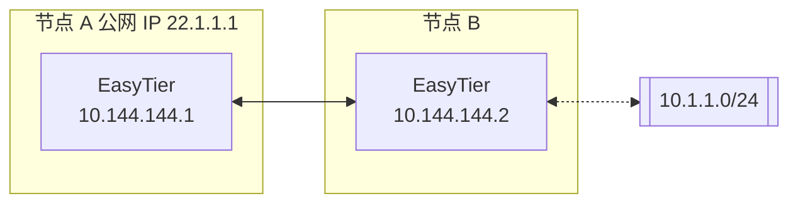
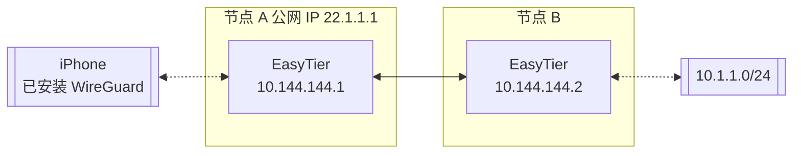

# EasyTier

[](https://github.com/lovitus/EasyTier/releases)
[](LICENSE)
[](https://github.com/lovitus/EasyTier/commits/main)
[](https://github.com/lovitus/EasyTier/issues)
[](https://github.com/lovitus/EasyTier/actions/workflows/core.yml)
[](https://github.com/lovitus/EasyTier/actions/workflows/gui.yml)
[](https://github.com/lovitus/EasyTier/actions/workflows/test.yml)
[](https://deepwiki.com/EasyTier/EasyTier)

[简体中文](README_CN.md) | [English](README.md)

> ✨ 基于上游 EasyTier 的增强 fork：保留去中心化 mesh 组网，并增加策略路由、可选
> peer 出口、Stealth 和实验性传输能力。

<p align="center">


</p>

📚 **[上游基础文档](https://easytier.cn)** | 🖥️ **[Web 控制台](https://easytier.cn/web)** | 📝 **[下载本 Fork](https://github.com/lovitus/EasyTier/releases)** | 🍃 **[Leaf 使用指南](easytier/docs/leaf_policy_proxy_cn.md)** | ❤️ **[赞助](#赞助)**

> [!IMPORTANT]
> 本仓库的 Leaf/HEV、Stealth 扩展和 `quic-brutal` 等能力只存在于本 fork。
> 上游 `EasyTier/EasyTier` 的安装脚本、Homebrew 包和 Release 不包含这些增量。
> 需要 fork 功能时，请只使用
> [`lovitus/EasyTier` 的正式 Release](https://github.com/lovitus/EasyTier/releases)；
> `EasyTier Profiling Beta` 是诊断制品，不是生产发布。

## 本 Fork 能做什么

基础 EasyTier mesh 仍保持原来的跨平台用途。fork 新增的 Leaf 策略层可以按首条匹配
规则执行 DIRECT/REJECT、域名与 IP 分流、GeoSite/GeoIP、FakeDNS，以及
SOCKS5、Shadowsocks/UoT、Trojan、VMess、VLESS、chain 和 fallback。通过端口省略的
`via: mesh`，可以把**具备 Leaf/HEV 能力的 EasyTier peer**选作 TCP/UDP 出口；目标
peer 不需要另外启动 SOCKS 服务，HEV 会在第一次被选中时按需启动。

### 功能和平台进度

| 能力 | 当前状态 | 平台和边界 |
| --- | --- | --- |
| 基础 mesh、NAT 穿透、子网代理、WireGuard | 稳定，继承上游 | Windows、macOS、Linux、FreeBSD、Android 等上游支持平台 |
| Leaf 策略路由 v1 | 已实现并完成正式实机验证 | Linux x86_64/aarch64、Android |
| 托管 HEV peer 出口 | 已实现并完成正式实机验证 | Linux x86_64/aarch64、Android；仅能选择具备相同能力的 peer，按需启动而非常驻 |
| macOS Leaf/托管 HEV | 预发布完善中 | x86_64/aarch64 已有代码和打包路径，但在完成精确制品实机验证并进入正式 Release 前不声明正式支持 |
| Windows Leaf 策略路由 | 预发布候选 | x86_64/i686/ARM64 的 Core 与 GUI 构建路径均包含 Leaf worker 和 Wintun；精确安装制品完成 Windows 实机验证前不声明正式支持 |
| FreeBSD、其他 Linux 架构、iOS/OHOS Leaf；Windows 托管 HEV | 尚未支持 | 仍可使用基础 mesh，但不能使用表中所列的 Leaf/HEV 路径 |
| 多传输 Stealth 与传输优先级 | 已发布 | 使用前必须阅读[兼容性说明](easytier/docs/udp_stealth_compatibility.md) |
| `quic-brutal` | 实验性、必须显式启用 | EasyTier 私有 overlay，不兼容 Hysteria2；不同链路不保证都比普通 QUIC BBR 更快 |

Leaf 使用的是 EasyTier 定义并严格校验的配置子集，不是 Mihomo、Leaf 或 sing-box
配置的完整兼容层。SS2022、Reality、XTLS/XUDP/XHTTP、VMess legacy alter-id 等未实现
字段不会被静默忽略。完整示例、协议边界和 Linux/Android 启用步骤见
[Leaf 策略路由指南](easytier/docs/leaf_policy_proxy_cn.md)。

### 最短使用入口

- **Android**：安装本 fork 的正式 APK；为网络设置固定虚拟 IPv4；在网络停止时从
  GUI 开启 Policy Routing、编辑/保存策略，然后启动网络并授予 VPN 权限。
- **Linux**：只有在正式 Release 同时提供 `easytier-core`、`easytier-cli`、
  `easytier-leaf-worker` 和 `easytier-hev-socks-egress` 时，才使用该 Release 启用
  Leaf。四个文件应放在同一目录；不要混用不同版本，也不要手工启动 HEV。
- **Windows**：只使用同时包含 `easytier-leaf-worker.exe` 和对应架构
  `wintun.dll` 的正式 Core ZIP 或 GUI 安装包，并以管理员权限运行；无需另行安装
  Wintun。
- **选择 peer 出口**：在 policy 中使用 `via: mesh` 并省略 `port`，将
  `server.virtual-ip` 或 `instance-id` 指向支持 Leaf/HEV 的目标 peer。它不是“mesh
  中任意平台的 peer 都自动能当出口”。
- **保守升级**：不配置或不启用 `policy_proxy` 时，继续使用原有 mesh 数据面。首次
  启用策略路由前应保留一份可工作的网络配置，并先验证 DNS、规则顺序和出口可达性。

## 特性

### 核心特性

- 🔒 **去中心化**：节点平等且独立，无需中心化服务
- 🚀 **易于使用**：支持通过网页、客户端和命令行多种操作方式
- 🌍 **跨平台**：支持 Win/MacOS/Linux/FreeBSD/Android 和 X86/ARM/MIPS 架构
- 🔐 **安全**：AES-GCM 或 WireGuard 加密，防止中间人攻击

### 高级功能

- 🔌 **高效 NAT 穿透**：支持 UDP 和 IPv6 穿透，可在 NAT4-NAT4 网络中工作
- 🌐 **子网代理**：节点可以共享子网供其他节点访问
- 🔄 **智能路由**：延迟优先和自动路由选择，提供最佳网络体验
- ⚡ **高性能**：整个链路零拷贝，支持 TCP/UDP/WSS/WG 协议

### 网络优化

- 📊 **UDP 丢包抗性**：KCP/QUIC 代理在高丢包环境下优化延迟和带宽
- 🔧 **Web 管理**：通过 Web 界面轻松配置和监控
- 🛠️ **零配置**：静态链接的可执行文件，简单部署

## 快速开始

### 📥 安装

需要本 fork 新功能时，推荐直接从
[`lovitus/EasyTier` Release](https://github.com/lovitus/EasyTier/releases)
下载对应平台的正式制品，并阅读该版本的 Release Notes。不要把同页的
`EasyTier Profiling Beta` 当作正式安装包。

下面的一键脚本、Homebrew、Cargo 和 OpenWrt 入口来自上游，只适合安装基础 EasyTier；
它们不会安装本 fork 的 Leaf/HEV 等增量：

Linux（推荐）：
```bash
curl -fsSL "https://github.com/EasyTier/EasyTier/blob/main/script/install.sh?raw=true" | sudo bash -s install
```

Homebrew（MacOS/Linux）：
```bash
brew tap brewforge/chinese
brew install --cask easytier-gui
```

Windows（推荐，请以管理员权限运行）：
```powershell
irm "https://github.com/EasyTier/EasyTier/blob/main/script/install.ps1?raw=true" | iex
```

通过 cargo 安装（最新开发版本）：
```bash
cargo install --git https://github.com/EasyTier/EasyTier.git easytier
```

[下载上游预编译文件](https://github.com/EasyTier/EasyTier/releases)（仅基础 EasyTier）

[通过 Docker 安装](https://easytier.cn/guide/installation.html#%E5%AE%89%E8%A3%85%E6%96%B9%E5%BC%8F)

[安装 OpenWrt ipk 软件包](https://github.com/EasyTier/luci-app-easytier)

附加步骤：

[一键注册系统服务](https://easytier.cn/guide/network/oneclick-install-as-service.html)（系统启动时自动后台运行）

### Fork 的预发布验证与发布顺序

本 fork 将“开发中的真机验证”和“正式发布构建”明确分开，避免每次修复都消耗完整的跨平台构建资源：

1. 修复提交 push 到 `releases/**` 前，在 commit message 中加入 `[skip ci]`，避免该次 push 自动启动完整 workflow 集合。
2. push 完成后，只手动运行 `EasyTier GUI macOS ARM64 Test`，并选择刚刚 push 的同一 ref。
3. 使用该 workflow 产出的 macOS ARM64 GUI 进行真机功能验证。此阶段不得由自动化代理触发 Core、GUI 全平台、Mobile、OHOS、完整 Test 或 Release。
4. 只有在维护者明确确认真机验证通过后，才为同一 commit 显式补跑正式发布所需的 `EasyTier Core`、`EasyTier GUI`、`EasyTier Mobile`、`EasyTier Test` 和 `EasyTier OHOS`。
5. 上述 workflow 全部成功后，再手动运行 `EasyTier Release`，填写发布版本号，由发布流程创建 tag 和 GitHub Release。

说明：

- 不要在真机验证前创建 tag，也不要提前触发 `EasyTier Release`。
- `EasyTier Release` 会根据所选 ref 对应的 commit SHA 自动解析所需 workflow run ID，校验发布版本与 Cargo 元数据一致，并拒绝覆盖已有 tag。
- 如果 `EasyTier Release` 提示缺少成功的 workflow run，说明当前 commit 尚未完成全部正式发布构建，需要先补齐对应 workflow。
- OHOS 产物会一并放入 GitHub Release；这个 fork 的发布流程不包含 Docker workflow。

## 本 Fork 与上游的差异

这个仓库已经不再是上游 EasyTier 的“无差别镜像”。下面的摘要反映的是 fork 相对上游
的实际增量。如果你要对比上游行为、评估升级影响、或者决定哪些参数应该开启，建议先
看这一段：

- 已修复或强化的问题：多传输 stealth rollout 与兼容路径；direct / hole-punch 的
  目标级回环避退，不再动辄升级为大范围 scheme suppression；QUIC/KCP Proxy 就绪 ACK
  与分类 fallback；UDP stealth fallback 预算与 datagram phase 切换时序；QUIC/KCP
  Proxy 本地 TCP capture 伪源地址和 exact-local SYN 递归回环；native TCP proxy NAT
  entry 查找 / 交接；KCP
  关闭路径尾包清理；以及 feature-gated 构建下更准确的 Proxy capability 广告。
- 本 fork 新增或扩展的能力：`udp`、`tcp`、`faketcp`、`quic`、`wg`、`ws`、`wss`
  的多传输 stealth；direct-connect `transport_priority`；legacy UDP 打洞拒绝控制；
  构建在原有 QUIC/KCP Proxy 之上的 readiness ACK、按传输维度的健康状态和回退原因；
  以及 Linux `tun` feature 构建下，在设备 cgroup 或设备节点禁止 TUN 时可用的原生
  veth NIC fallback；默认启用的 underlay 候选地址净化会避免把常见系统 TUN/fake-IP
  网段和 EasyTier 自身虚拟地址通告或拨打为 direct underlay。
- 与上游不同的行为：strict stealth UDP listener 会静默丢弃 legacy probe；Proxy 固定
  顺序是 `QUIC -> KCP -> Native`；回环处理是“目标级避退强化”，不是“从此不再出现任何
  回环流量”；`transport_priority` 只影响 direct-connect；`disable_quic_input` /
  `disable_kcp_input` 不会关闭底层 listener；双栈 peer 的 exact 规则同时命中时 IPv4
  优先。与 Mihomo/Clash/sing-box TUN 同时运行时，内置 underlay guard 会减少明显污染
  的直连候选，但它不是“所有 generic underlay socket 都跨平台强制绕过系统 TUN”的硬保证；
  复现和边界见
  [Mihomo TUN 共存风险](easytier/docs/mihomo_tun_interop_cn.md)。
- 本 fork 新增的参数：`--stealth-mode`、`--stealth-window-secs`、
  `--stealth-protocols`、`--disable-legacy-udp-hole-punch`、
  `--transport-priority`、`--underlay-candidate-guard`、
  `--underlay-exclude-cidrs`，以及仅 Linux 提供的 `--nic-backend`。
- 上游原本就有、但在本 fork 下相关行为发生变化的参数：
  `--enable-kcp-proxy`、`--enable-quic-proxy`、`--disable-kcp-input`、
  `--disable-quic-input` 不是本 fork 新发明的参数；变化的是它们周边的 Proxy
  failover、readiness ACK、健康状态和 capability 行为。

完整清单、配置示例和兼容边界见
[fork 差异与配置说明](easytier/docs/fork_differences_cn.md)。Stealth、Proxy、回退和
rollout 细节仍以 [兼容性说明](easytier/docs/udp_stealth_compatibility.md) 为准。
2026-07-08 的远端验证报告记录在
[performance_validation_2026_07_08.md](easytier/docs/performance_validation_2026_07_08.md)；
Stealth/Secure 后续问题见
[stealth_secure_known_bugs.md](easytier/docs/known_bugs/stealth_secure_known_bugs.md)。
v2.6.9 发布说明及 Secure/Stealth 性能与故障切换取舍见
[release_notes/v2.6.9.md](easytier/docs/release_notes/v2.6.9.md)。

### 常见配置坑点

- `--transport-priority` 必须写成带 scope 的规则，例如
  `global:quic,faketcp,ws,wg,udp,tcp`；直接写 `quic,faketcp,ws,wg,udp,tcp`
  会校验失败。
- `--transport-priority` 一旦设置，direct-connect 就不再按 `default_protocol`
  选协议。
- `--transport-priority` 受延迟约束：在已建立连接里，偏好协议只有在 RTT 不超过最低
  RTT 连接的 125% 时才会被选为承载链路，避免因为配置偏好强行切到明显更慢的 underlay。
- `--stealth-mode` 只有在 `network_secret` 非空时才真正生效；未显式配置
  `secure_mode` 时，认证密钥只在运行期派生，不会写回 TOML/RPC。密钥为空时只会告警并
  继续走 plain。
- `stealth_mode=true` 加运行期派生 secure 已确认会进入 Stealth-protected PeerConn
  secure session 路径，但它不等同于显式全局 `secure_mode`。比较安全语义和性能时应先看
  验证报告。
- 最终候选中，显式 `secure_mode + stealth_mode` 比派生 Stealth 慢，但没有复现历史候选
  接近 10 倍的下降；relay/foreign-network profiling 仍作为 known bug 后续跟踪。
- 已有配置如果已经包含显式 `[secure_mode]` 段，但没有再显式写
  `stealth_mode=true`，仍会保持旧版 plain 行为。
- `--disable-legacy-udp-hole-punch` 即使在 UDP stealth 未生效时，也仍会拒绝没有
  stealth 偏好的旧版 UDP 打洞请求。
- `--nic-backend tun|veth|auto` 只属于 CLI，默认仍为 `tun`。`auto` 只在 TUN
  设备创建失败时回退；MTU、地址或路由配置失败仍是硬错误。`veth/auto` 与
  `--no-tun` 冲突。
- EasyTier 与 sing-box/Mihomo/Clash/NekoBox/Throne 等系统 TUN 代理工具同时运行时，
  必须把 EasyTier 进程从代理/TUN 路径排除。仅写代理规则 `DIRECT` 不一定能绕过
  TUN；如果工具提供 process/route bypass、route-exclude 或等价能力，应优先使用。
  至少把下面规则放在通用代理规则之前：

  ```yaml
  - PROCESS-NAME,io.tailscale.ipn.macsys.network-extension,DIRECT
  - PROCESS-NAME,tailscaled,DIRECT
  - PROCESS-NAME,tailscaled.exe,DIRECT
  - PROCESS-NAME,tailscale,DIRECT
  - PROCESS-NAME,tailscale.exe,DIRECT
  - PROCESS-NAME,easytier-gui,DIRECT
  - PROCESS-NAME,easytier-gui.exe,DIRECT
  - PROCESS-NAME,easytier-core,DIRECT
  - PROCESS-NAME,easytier-core.exe,DIRECT
  - PROCESS-NAME-REGEX,(?i)^easytier(?:[-_.].*)?$,DIRECT
  - PROCESS-NAME,easytier-*,DIRECT
  - PROCESS-NAME,easytier-cli,DIRECT
  - PROCESS-NAME,easytier-cli.exe,DIRECT
  ```

  `PROCESS-NAME,easytier-*` 是否生效取决于客户端是否支持进程名通配；不要只依赖这一条，
  保留精确进程名和 regex 规则。规则列表底部、最终 `MATCH`/兜底规则之前，还应把
  Tailscale 和 EasyTier 虚拟网段设为直连：

  ```yaml
  - IP-CIDR,100.64.0.0/10,DIRECT,no-resolve
  - IP-CIDR,10.44.0.0/16,DIRECT,no-resolve
  ```

  如果 EasyTier 虚拟网段不是 `10.44.0.0/16`，替换为实际网段。详见
  [Mihomo TUN 共存风险](easytier/docs/mihomo_tun_interop_cn.md)。
- `--underlay-candidate-guard` 过滤的是 EasyTier 对外通告/主动拨打的 underlay
  candidate，以及相关 bind-source 与 direct-UDP 路由源校验。命中 guard 的公网
  IPv4 UDP 直连候选会直接 fail-closed 跳过，不再退回 generic direct fallback。

### Linux veth NIC fallback

Linux 的 `--nic-backend veth` 使用隔离 veth peer 和 AF_PACKET 提供 EasyTier 的 L3
虚拟网卡边界。它需要 `CAP_SYS_ADMIN + CAP_NET_ADMIN + CAP_NET_RAW`，用于容器允许
网络管理、但 `/dev/net/tun` 或 device cgroup 不允许 TUN 的场景，不解决普通无特权
容器问题。`--nic-backend auto` 始终先尝试 TUN，默认路径不变。

veth 后端保留 `169.254.255.254` 和 `fe80::e:1` 作为内部 gateway。用户地址以及除
默认路由外的动态路由不得包含这两个地址；冲突路由会明确拒绝，不会静默安装。该参数
不写入 TOML、protobuf 或 GUI 配置。

旧内核 link-local 清理失败发生在设备 Ready 之前，实例会失败并清理接口，不会带病
进入数据面。实例停止或 DHCP 重建时主动删除 veth 是预期生命周期，不需要等待转发
任务持有的每个内部引用自然释放。后端按设计抑制 veth 路径的链路控制协议；普通
IPv4/IPv6 单播、广播和组播数据仍会转发，EasyTier 的常规组播也不依赖 IGMP 成员关系
选路。这些行为不影响现有功能，无需为追求与 TUN 的内部实现形式一致而修改。

### Stealth 与传输策略

Stealth 默认开启并保护 `udp`、`tcp`、`faketcp`、`quic`、`wg`、`ws` 和 `wss`。
它需要非空网络密钥；未显式配置 `secure_mode` 时，认证握手密钥只在运行期派生，
不会序列化保存。派生密钥只用于 Stealth-protected PeerConn 握手，不发布到
RoutePeerInfo，也不会启用全局 relay/session secure mode。显式 `secure_mode` 仍是
credential/Noise 的高级配置。显式把 `stealth_protocols` 清空时，会恢复兼容 rollout
的“仅 UDP stealth”行为。
`stealth_window_secs` 的有效值是网络级参数，
所有 Stealth 节点必须一致。`transport_priority` 只重排 direct-connect 底层协议；
QUIC/KCP Proxy 故障转移固定采用 `QUIC -> KCP -> Native`。`transport_priority`
的格式必须是 `scope:proto,...;scope:proto,...`，例如
`global:quic,faketcp,ws,wg,udp,tcp`。已建立连接的数据面选择会先应用 125% RTT
合格线，再在合格集合内按协议偏好排序。混合部署细节见
[兼容性说明](easytier/docs/udp_stealth_compatibility.md)。
实验性 `quic-brutal` overlay 的显式启用方式、双向 `tx_mbps`、GUI/CLI 配置、
Stealth 行为和状态检查见
[quic-brutal 使用说明](easytier/docs/quic_brutal.md)。

运维上可以按下面的表理解：

| 配置方式 | 保护什么 | 不启用什么 |
| --- | --- | --- |
| GUI/新默认：`network_secret` + Stealth | 配置传输的 Stealth 外层握手，以及 Stealth-protected PeerConn 的 payload。 | RoutePeerInfo 公钥发布、全局 RelayPeerMap/PeerManager secure relay/session、credential 身份。 |
| 显式 `secure_mode.enabled=true` | 完整显式 Noise 身份、RoutePeerInfo 公钥发布、secure relay/session 语义、credential 兼容身份。 | 不是让默认 Stealth 工作的必要条件。 |

人话版：GUI 的 Stealth 是把 `udp`、`tcp`、`faketcp`、`quic`、`wg`、`ws`、`wss`
这些连接入口隐藏起来并做认证，避免随机探测直接看到 EasyTier 明文握手。显式
`secure_mode=true` 是另一层高级身份模式：节点会发布 Noise 公钥，可以被其他节点
pin，参与 secure relay/session，也支持 credential 临时节点在不知道 `network_secret`
的情况下入网。
当前 GUI 只编辑 Stealth 偏好；显式 `secure_mode` 仍属于 CLI/TOML/RPC 高级配置。
后续 GUI 全局安全身份入口的计划记录在
[gui_global_secure_identity.md](easytier/docs/todo/gui_global_secure_identity.md)。

### 🚀 基本用法

#### 使用共享节点快速组网

EasyTier 支持使用共享节点快速组网。当您没有公网 IP 时，可以使用公共共享节点。节点会自动尝试 NAT 穿透并建立 P2P 连接。当 P2P 失败时，数据将通过共享节点中继。

使用共享节点时，每个进入网络的节点需要提供相同的 `--network-name` 和 `--network-secret` 参数作为网络的唯一标识符。

以两个节点为例（请使用更复杂的网络名称以避免冲突）：

1. 在节点 A 上运行：

```bash
# 以管理员权限运行
sudo easytier-core -d --network-name abc --network-secret abc -p tcp://<共享节点IP>:11010
```

2. 在节点 B 上运行：

```bash
# 以管理员权限运行
sudo easytier-core -d --network-name abc --network-secret abc -p tcp://<共享节点IP>:11010
```

执行成功后，可以使用 `easytier-cli` 检查网络状态：

```text
| ipv4         | hostname       | cost  | lat_ms | loss_rate | rx_bytes | tx_bytes | tunnel_proto | nat_type | id         | version         |
| ------------ | -------------- | ----- | ------ | --------- | -------- | -------- | ------------ | -------- | ---------- | --------------- |
| 10.126.126.1 | abc-1          | Local | *      | *         | *        | *        | udp          | FullCone | 439804259  | 2.6.2-70e69a38~ |
| 10.126.126.2 | abc-2          | p2p   | 3.452  | 0         | 17.33 kB | 20.42 kB | udp          | FullCone | 390879727  | 2.6.2-70e69a38~ |
|              | PublicServer_a | p2p   | 27.796 | 0.000     | 50.01 kB | 67.46 kB | tcp          | Unknown  | 3771642457 | 2.6.2-70e69a38~ |
```

您可以测试节点之间的连通性：

```bash
# 测试连通性
ping 10.126.126.1
ping 10.126.126.2
```

注意：如果无法 ping 通，可能是防火墙阻止了入站流量。请关闭防火墙或添加允许规则。

为了提高可用性，您可以同时连接多个共享节点：

```bash
# 连接多个共享节点
sudo easytier-core -d --network-name abc --network-secret abc -p tcp://<公共节点IP>:11010 -p udp://<公共节点IP>:11010
```

#### 去中心化组网

EasyTier 本质上是去中心化的，没有服务器和客户端的区分。只要一个设备能与虚拟网络中的任何节点通信，它就可以加入虚拟网络。以下是如何设置去中心化网络：

1. 启动第一个节点（节点 A）：

```bash
# 启动第一个节点
sudo easytier-core -i 10.144.144.1
```

启动后，该节点将默认监听以下端口：
- TCP：11010
- UDP：11010
- WebSocket：11011
- WebSocket SSL：11012
- WireGuard：11013

2. 连接第二个节点（节点 B）：

```bash
# 使用第一个节点的公网 IP 连接
sudo easytier-core -i 10.144.144.2 -p udp://第一个节点的公网IP:11010
```

注意：开启 `--stealth-mode` 后，固定 `udp://` listener 不再接受 plain SYN 探测。
新节点主动连接 legacy 端点时可用独立尝试回退 plain，但 legacy 节点主动连接 strict
UDP stealth listener 仍会被静默丢弃。默认 `--stealth-protocols` 已列出所有支持的传输；
显式清空该值才是“仅保护 UDP”的兼容覆盖。详见
[stealth 兼容性说明](easytier/docs/udp_stealth_compatibility.md)。当前验证发现 TCP
Stealth listener 在一个同 secret 混合场景下仍接受 plain 客户端，限制见
[Stealth/Secure 已知问题](easytier/docs/known_bugs/stealth_secure_known_bugs.md)。

3. 验证连接：

```bash
# 测试连通性
ping 10.144.144.2

# 查看已连接的对等节点
easytier-cli peer

# 查看路由信息
easytier-cli route

# 查看本地节点信息
easytier-cli node
```

更多节点要加入网络，可以使用 `-p` 参数连接到网络中的任何现有节点：

```bash
# 使用任何现有节点的公网 IP 连接
sudo easytier-core -i 10.144.144.3 -p udp://任何现有节点的公网IP:11010
```

### 🔍 高级功能

#### 子网代理

假设网络拓扑如下，节点 B 想要与其他节点共享其可访问的子网 10.1.1.0/24：



要共享子网，在启动 EasyTier 时添加 `-n` 参数：

```bash
# 与其他节点共享子网 10.1.1.0/24
sudo easytier-core -i 10.144.144.2 -n 10.1.1.0/24
```

子网代理信息将自动同步到虚拟网络中的每个节点，每个节点将自动配置相应的路由。您可以验证子网代理设置：

1. 检查路由信息是否已同步（proxy_cidrs 列显示代理的子网）：

```bash
# 查看路由信息
easytier-cli route
```


2. 测试是否可以访问代理子网中的节点：

```bash
# 测试到代理子网的连通性
ping 10.1.1.2
```

#### WireGuard 集成

EasyTier 可以作为 WireGuard 服务器，允许任何安装了 WireGuard 客户端的设备（包括 iOS 和 Android）访问 EasyTier 网络。以下是设置示例：



1. 启动启用 WireGuard 门户的 EasyTier：

```bash
# 在 0.0.0.0:11013 上监听，并使用 10.14.14.0/24 子网作为 WireGuard 客户端
sudo easytier-core -i 10.144.144.1 --vpn-portal wg://0.0.0.0:11013/10.14.14.0/24
```

2. 获取 WireGuard 客户端配置：

```bash
# 获取 WireGuard 客户端配置
easytier-cli vpn-portal
```

3. 在输出配置中：
   - 将 `Interface.Address` 设置为 WireGuard 子网中的可用 IP
   - 将 `Peer.Endpoint` 设置为您的 EasyTier 节点的公网 IP/域名
   - 将修改后的配置导入到您的 WireGuard 客户端

#### 自建公共共享节点

您可以运行自己的公共共享节点来帮助其他节点相互发现。公共共享节点只是一个普通的 EasyTier 网络（具有相同的网络名称和密钥），其他网络可以连接到它。

要运行公共共享节点：

```bash
# 公共共享节点无需指定 IPv4 地址
sudo easytier-core --network-name mysharednode --network-secret mysharednode
```

网络设置成功后，您可以轻松配置它以在系统启动时自动启动。请参阅 [一键注册服务指南](https://easytier.cn/en/guide/network/oneclick-install-as-service.html) 了解如何将 EasyTier 注册为系统服务。

## 相关项目

- [ZeroTier](https://www.zerotier.com/)：用于连接设备的全球虚拟网络。
- [TailScale](https://tailscale.com/)：旨在简化网络配置的 VPN 解决方案。

### 联系我们

- 💬 **[Telegram 群组](https://t.me/easytier)**
- 👥 **QQ 群**
  - 一群 [949700262](https://qm.qq.com/q/wFoTUChqZW)
  - 二群 [837676408](https://qm.qq.com/q/4V33DrfgHe)
  - 三群 [957189589](https://qm.qq.com/q/YNyTQjwlai)

## 许可证

EasyTier 在 [LGPL-3.0](https://github.com/EasyTier/EasyTier/blob/main/LICENSE) 许可下发布。

## 赞助

本项目的 CDN 加速和安全防护由腾讯云 EdgeOne 赞助。

<p align="center">
<a href="https://edgeone.ai/?from=github" target="_blank">

</a>
</p>

特别感谢 [浪浪云](https://langlangy.cn/?i26c5a5) 和 [雨云](https://www.rainyun.com/NjM0NzQ1_) 赞助我们的公共服务器。

<p align="center">
<a href="https://langlangy.cn/?i26c5a5" target="_blank">

</a>
<a href="https://langlangy.cn/?i26c5a5" target="_blank">

</a>
</p>

如果您觉得 EasyTier 有帮助，请考虑赞助我们。软件开发和维护需要大量的时间和精力，您的赞助将帮助我们更好地维护和改进 EasyTier。

<p align="center">


</p>
